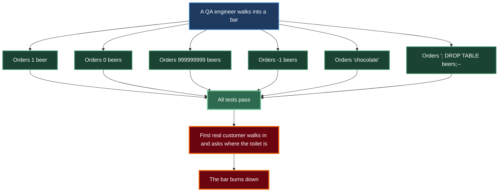

# Magnaibayar Ganzorig

I'm a software engineer who has spent about 14 years on the quiet backend parts of financial software — a stock exchange, a credit bureau, insurance systems — mostly in Java, Go, TypeScript, PHP and PostgreSQL.

These days I'm studying cybersecurity and slowly building a small product of my own.

  

  

  

  #### Certified Kubernetes Application Developer (CKAD)
  - **Issuer:** Cloud Native Computing Foundation & The Linux Foundation
  - **Credential URL:** [Verify on Credly](https://www.credly.com/badges/643ce4cf-9c64-4285-82db-60e7e4525511/public_url)

  

### 🧪 Edge Cases vs. Real World

